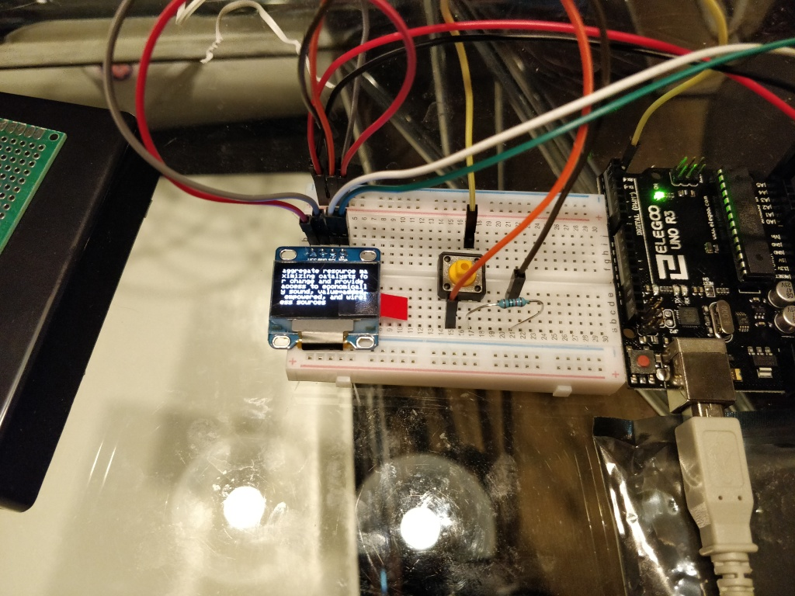
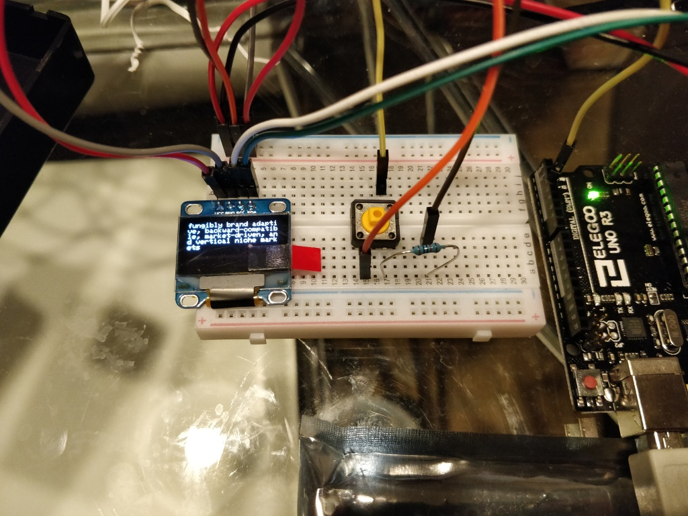

# Pocket Jim!

Pocket corporate gibberish generator.

## Directories
  * [jim/](): jim library
  * [pocket-jim/](): arduino sketch
  * [test/](): simple test application
  * [data/](): word list, screenshots

{:class="img-responsive"}
{:class="img-responsive"}
